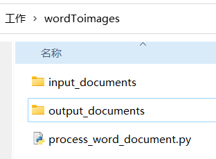
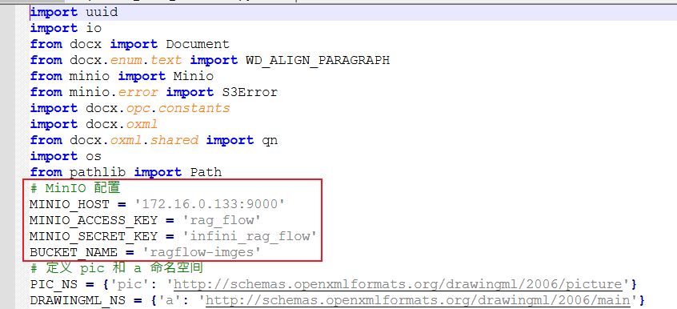
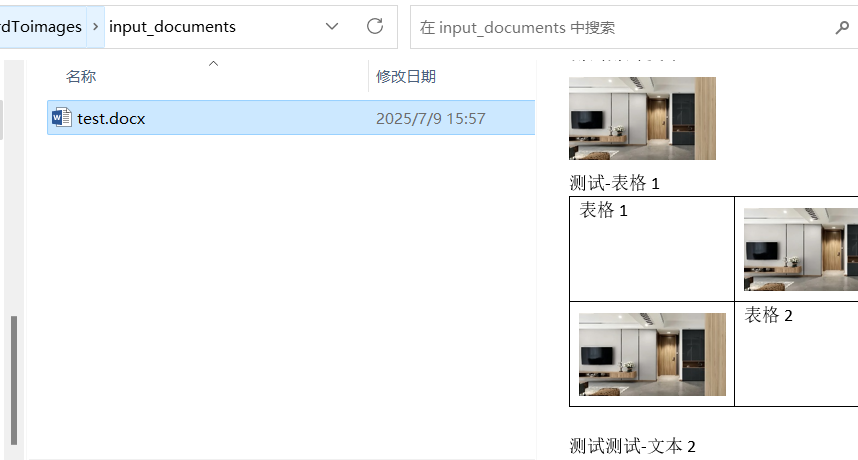
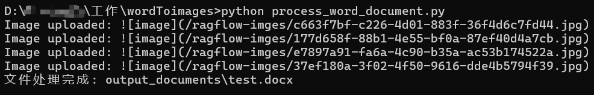
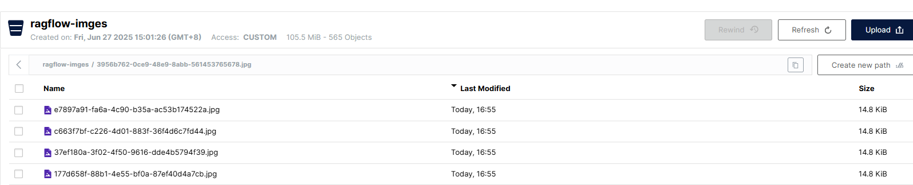
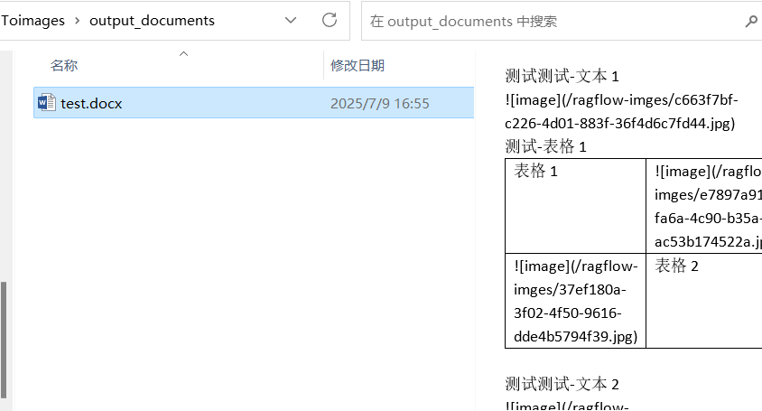

# RAGFlow_MinIO_images

原因：RAGFlow作为外部知识库，不支持处理图片链接服务  

解决方法：RAGFlow知识库预处理文档支持markdown格式图片链接，再上传知识库。即可使用nginx反代访问图片  

## 操作示例
1、拉取项目，确认结构  
  
2、修改为你RAGFlow的对象存储MinIO的地址、密码、存储图片的桶  
  
3、把要处理的文档放到input_documents文件夹  
  
4、安装python依赖包，执行py脚本，查看日志  
  
5、登录MinIO查看桶上传的图片  
  
6、到output_documents查看处理好的文档  
  
7、使用nginx反代访问图片  
8、更多。修改脚本的保存图片链接，加上地址可以直接访问  
